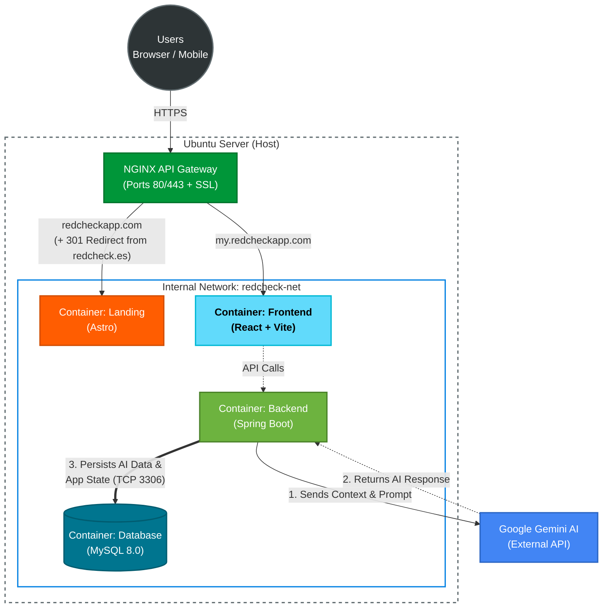

  

> An interactive time and task management ecosystem designed to prioritize daily workloads using artificial intelligence.

Welcome to the official GitHub organization for **RedCheck**. Here you will find the source code, architecture, and deployment configurations for the entire platform. 

RedCheck was engineered with a strict focus on performance, frictionless user experience, and scalable software architecture.

  <table>
    <tr>
      <td align="center"><b>Landing Page (Astro)</b></td>
      <td align="center"><b>Web Application (React)</b></td>
    </tr>
    <tr>
      <td></td>
      <td></td>
    </tr>
  </table>

## Repository Ecosystem

To maintain a clean separation of concerns, the RedCheck infrastructure is divided into specialized micro-repositories:

* **[redcheck-backend](https://github.com/redcheckapp/redcheck-backend):** The core API. Built with Java and Spring Boot. Handles stateless JWT authentication, complex business logic, MySQL database interactions, and the prompt engineering bridge with Google Gemini AI models.
* **[redcheck-frontend](https://github.com/redcheckapp/redcheck-frontend):** The main Single Page Application (SPA). Built with React, TypeScript, and Tailwind CSS. Features dynamic agenda views, recurrent task management, and an interactive AI priority board.
* **[redcheck-landing](https://github.com/redcheckapp/redcheck-landing):** The static presentation website. Built with Astro for zero-JS delivery by default and maximum SEO performance. Includes native internationalization (i18n) and smooth DOM animations.

## Core Technology Stack

**Frontend & UI**

**Backend & Data**

**Infrastructure**

## Infrastructure Overview

The entire platform is designed to be self-hosted via containerization. 

NGINX acts as the main entry point and reverse proxy. It routes global traffic between the static landing page on the root domain and the React application on the dedicated sub-domain, while securely proxying RESTful API requests to the isolated Spring Boot container network.

  

## Links & Resources

* **Official Website:** [redcheckapp.com](https://redcheckapp.com)
* **Web Application:** [my.redcheckapp.com](https://my.redcheckapp.com)
